

# TASCA 3 - FITXERS JAR 1:
## 1. Crear fitxe Jar

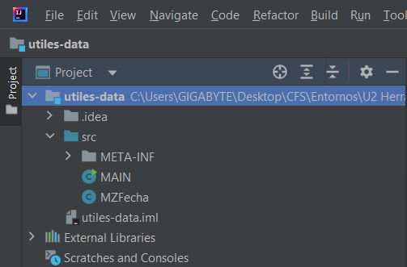
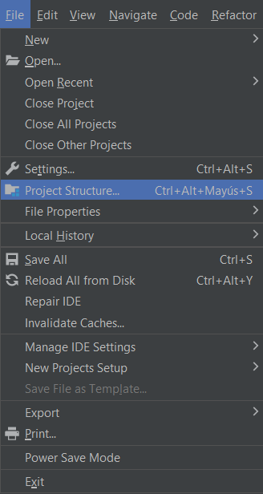
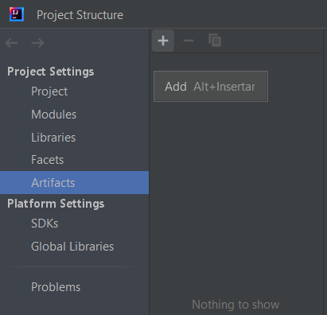
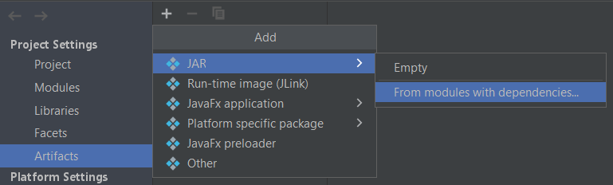
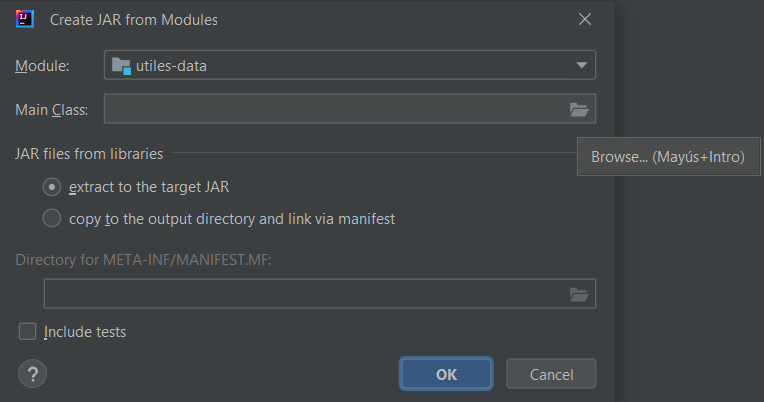
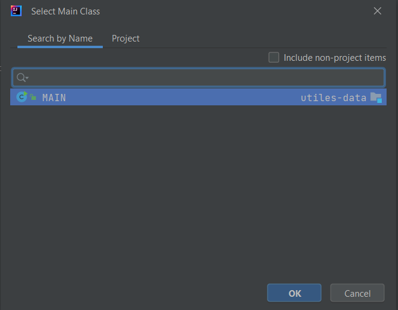
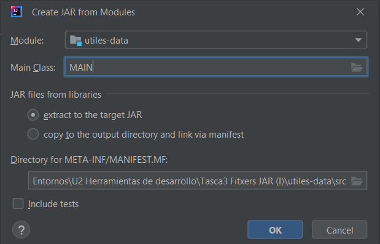
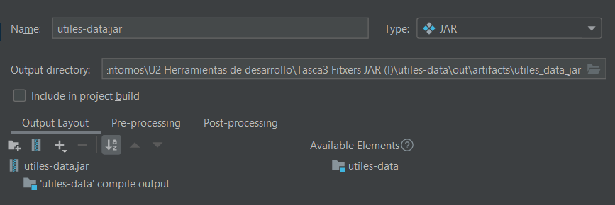
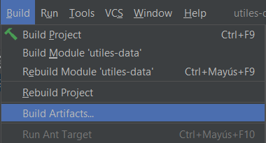
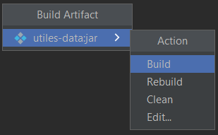
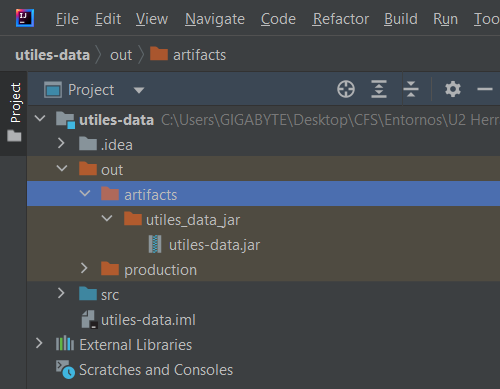

## 2. Projecte D-JAR1-MZFecha:
###### Mètode main:

>En el mètode main es construeixen els objectes i es crida a la funció menu.

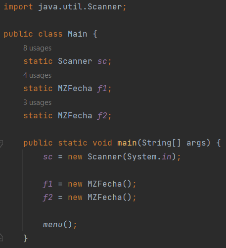

###### Funció menu:
>La funció menu consisteix d'un bucle while dins primer s'imprimeixen les opcions, després es guarda l'opció de l'usuari en la variable opcion que s'utilitzarà en un switch case, dins d'aquest depenent de l'opció elegida es cridara alguna de les funcions o es tancara el bucle i el programa. Per a introduir les dades es cirdara a la funció setFecha del jar utiles-data.

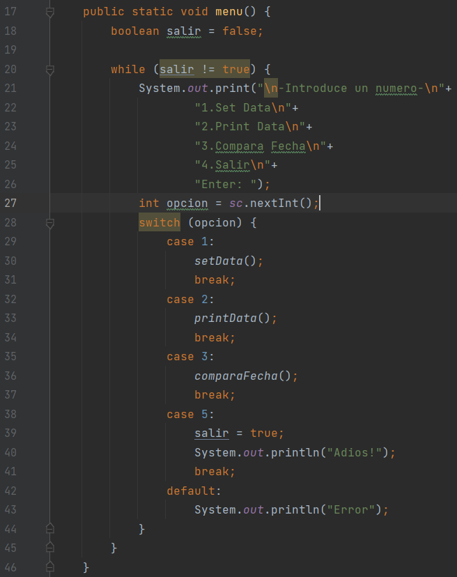

###### Funció setData
>En la funció data s'imprimiran uns missatges indicant la data a introduir, la data es guarda en la variable corresponent (dia, mes i any), després s'introduirà a l'objecte, creat al mètode main f1, les dades.

##### Funció printData
>En aquesta funció s'imprimiran les dades de l'objecte f1. Per a imprimir les dades es cridarà a la funció imprime del jar utiles-data.

##### Funció comparaFecha
>En la funció comparaFecha s'imprimiran uns missatges indicant la data a introduir, la data es guarda en la variable corresponent (dia, mes i any), després s'introduirà a l'objecte, creat al mètode main f2, les dades. Després Es crida a la funció direnciaDias per a imprimir els dies que hi ha entre les dues dades. Per a introduir les dades es cridarà a la funció setFecha i per a comparar les dades es cridarà a la funció diferencia dies del jar utiles-data.

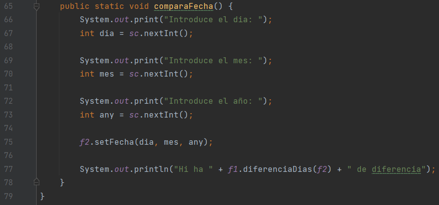