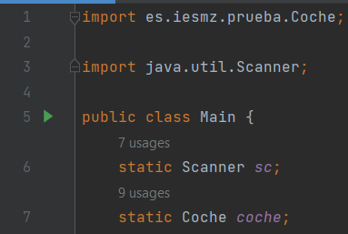
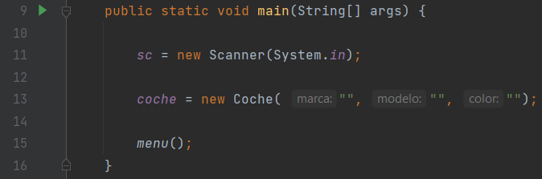
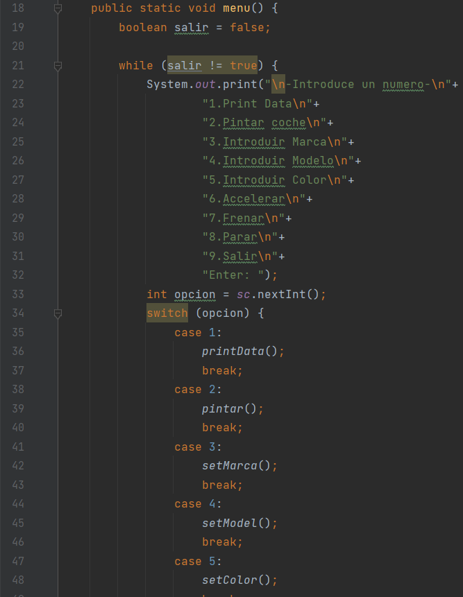
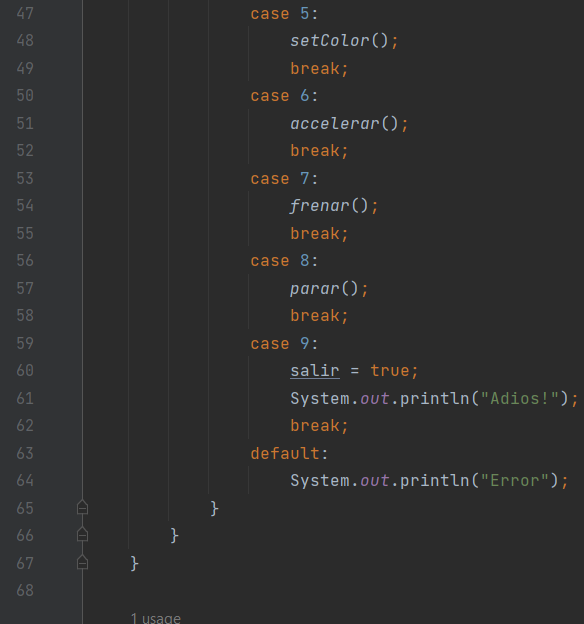

# TASCA 4 - FITXERS JAR 2:
## Projecte Exercici Jar 2:
###### Imports:

###### Mètode main:

>En el mètode main es construeixen el obejecte coche i es crida a la funció menu.

###### Funció menu:
>La funció menu consisteix d'un bucle while dins primer s'imprimeixen les opcions, després es guarda l'opció de l'usuari en la variable opcion que s'utilitzarà en un switch case, dins d'aquest depenent de l'opció elegida es cridara alguna de les funcions o es tancara el bucle i el programa. 

###### Funció setMarca
>En la funció setMarca s'imprimiran un missatge indicant que hi ha que introduir la marca del vehicle, deprés es guarda en la variable marca, per ultim s'introduirà a l'objecte creat al mètode main coche.

###### Funció setModel
>En la funció setModel s'imprimiran un missatge indicant que hi ha que introduir el model del vehicle, deprés es guarda en la variable modelo, per ultim s'introduirà a l'objecte creat al mètode main coche.

###### Funció setColor
>En la funció setColor s'imprimiran un missatge indicant que hi ha que introduir el color del vehicle, deprés es guarda en la variable color, després s'introduirà a l'objecte creat al mètode main coche.

##### Funció printData
>En aquesta funció s'imprimiran les dades de l'objecte coche. Per a imprimir les dades es cridarà a la funció imprime del jar coche-conpaquete.

##### Funció pintar
>En la funció pintar en pinta el vehicle amb espais representant la seua velocitat.

##### Funció parar
>En la funció parar es canvia la velocitat del vehicle a 0.

##### Funció accelerar
>En la funció accelarar s'aumenta la velocitat del vehicle sumada a la velocitat actual del vehicle.

##### Funció frenar
>En la funció frenar es redueix la velocitat del vehicle restant a la velocitat actual del vehicle la introduida.

