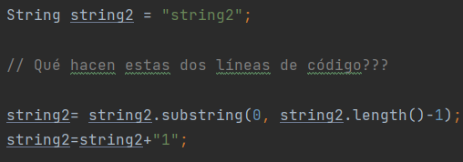
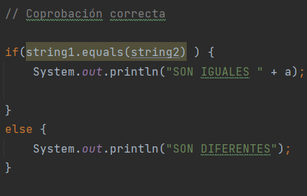

# Tasca1: Debug

## 1. En la función1... Què fan aquestes línies de codi?

> Primer es crea una variable del tipus string i es guarda "string2" en aquesta. Després la variable string2 s'iguala a si mateixa utilitzant substring, donat el rang des del 0 fins a la longitud de la variable menys u, per tant, la variable string s'iguala a "string". Finalment, string és iguala per si mateix concatenant u, resultant en "string1".

## 2. Què valen les variables string1 i string2 abans d'executar el codi de comprovació següent?

    if(string1 == string2 ) {
        System.out.println("SÓN IGUALS " + a );.
    } else {
        System.out.println("SÓN DIFERENTS");
    }

###### Les variables vale:

>string1 es igual a "string1"

>string2 es igual a "string2"

## 3. Per què no funciona l'operador == ? Quin operador s'ha d'usar en lloc d'aquest?

> L'operador == no es pot utilitzar en variables del tipus string perquè string és un array de chars i al ser un array és té que utilitzar la funció equals.

## 4. La función2() està declarada com segueix:

    public void funcion2() {
        System.out.println("--------------------");
        System.out.println("Aquesta és la funció 2");
        System.out.println("Com faig la crida perquè funcione????");
    }
    
> Per a cridar a la funció hi ha que escriure el nom de la mateixa en el main seguida de parèntesis i un punt i coma.

    funcion2();

